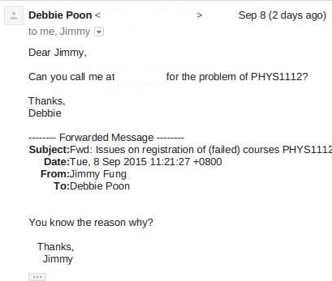
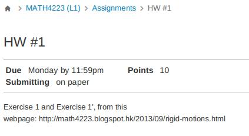

# 0910

## Academic Concerns

I am kind of freaking out today.

Yeah. Email,Phone is a scary,it were nothing like what it looked like.

I did just replied a **NoNoNo**. and see what happens, that took me quite a while to write that 50 words.

Apparently, Prof. Fung have no clue on that. And that makes me further anxious. I don't know what part you could help, hopeful, it just make sense at the end.

## Good News

A good news for me.

- The differential geometry course did provide the <i style="text-decoration: underline;">Due Date</i> `thing` to the Canvas `Thing`, the first one would be next Monday.

## New LMES `Canvas`

And the interesting part.

Good. Calendar time: 2015.

- Points
  - What does that even means?
- Due
  - Instead of Monday by 11:59pm
  - Please it is ()
  - a **From Now** concept is practically
  - There aren't even exact week,is it even already DUE,this monday?.
- Content
  - the reason the instructor doesn't directly copy and paste the question, as it simply doesn't support the math Latex(a.k.a Symbols).

And that it wasn't a Students' work, it was a USA company CALLED `INSTRUCTURE`.

`Instruct-ure` is a much better taste to name its product `Canvas`

## Articles

This article was written in the editor I showed you, there weren't anything fancy yet because I don't really have time to map the bindings to the standard browser.

I did make something to demonstrate, It takes sometimes to work on the publishing part. It's about the few videos mentioned during the session,namely butterfly effect,ice scotch glass, and some other thing.

## Apple Pencil

The Apple Pencil just released (partically Sept.) is pretty exciting news.

It wasn't a **good** Digital-Stylus that matters,it 's the popularity part will give me a very decent lead on my Online-Live-Lecturing-Platform.

An universe to be discovered, cheap ,correct,self-refined,contained education.

Prof. Fung might be answering question dragging details from his notes, writing on the iPad. Instead of Now, resolving a course detail takes multiple proxy.

A decent Shortener for my 50 years on my `You are never eating expired food again` - plan

Get the ShortCut by writing ShortCuts for keen learners.

2016 might be the year to learn the `Swift` the new-ish(ugly) Apple language.
